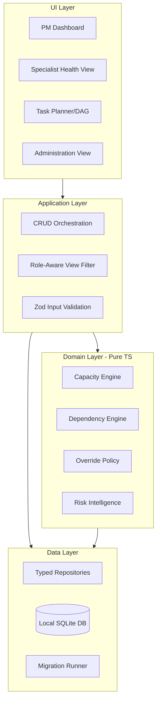

# Architecture & System Layout — OptiTask Resource Orchestrator

## Conceptual Layer Cake

## Module Boundaries

### Core Domain Modules
- **Specialist Management:** CRUD for specialist profiles and availability.
- **Task Management:** CRUD for tasks and DAG dependency links.
- **Allocation Management:** Logic for assigning specialists to tasks and validating against constraints.
- **Override Management:** Process for documenting and tracking capacity debt.
- **Audit & Monitoring:** Append-only event store for all state changes.

### Intelligence & Privacy Modules
- **Personal Health Shield:** Generates utilization heatmaps and fatigue alerts for specialists.
- **Risk Intelligence:** Analyzes the DAG for schedule drift and critical path risks.
- **Privacy Boundary:** Enforces data filtering based on the role (PM, Specialist, Auditor) at the service level.
